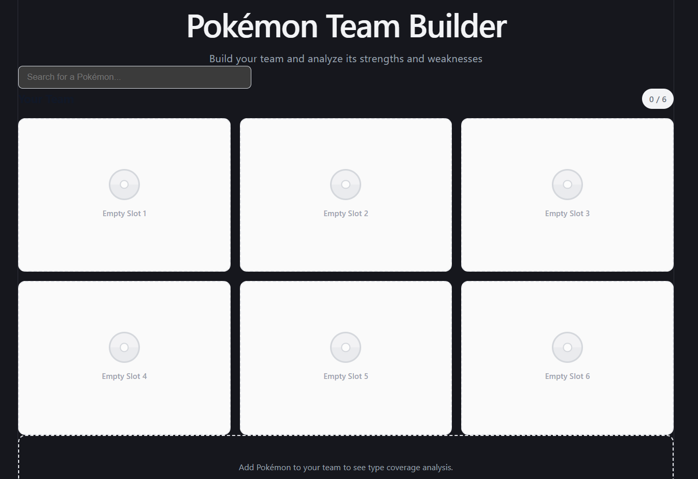
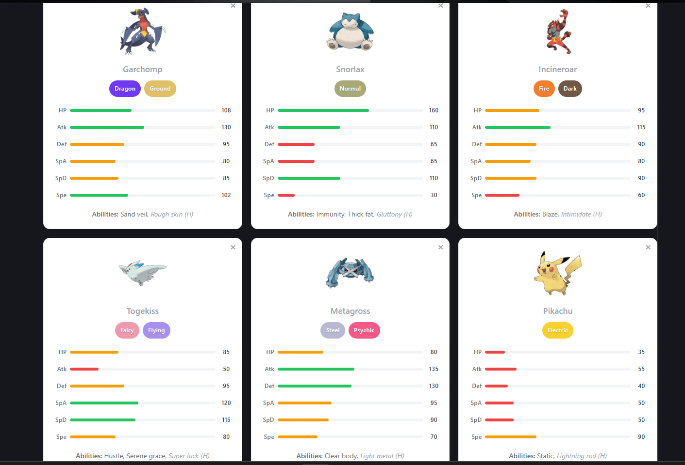
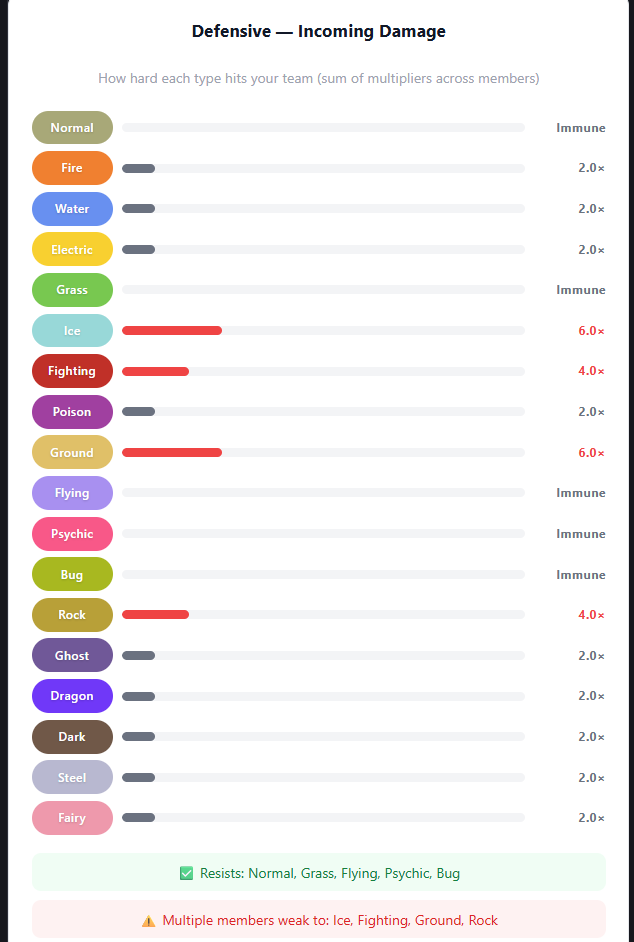
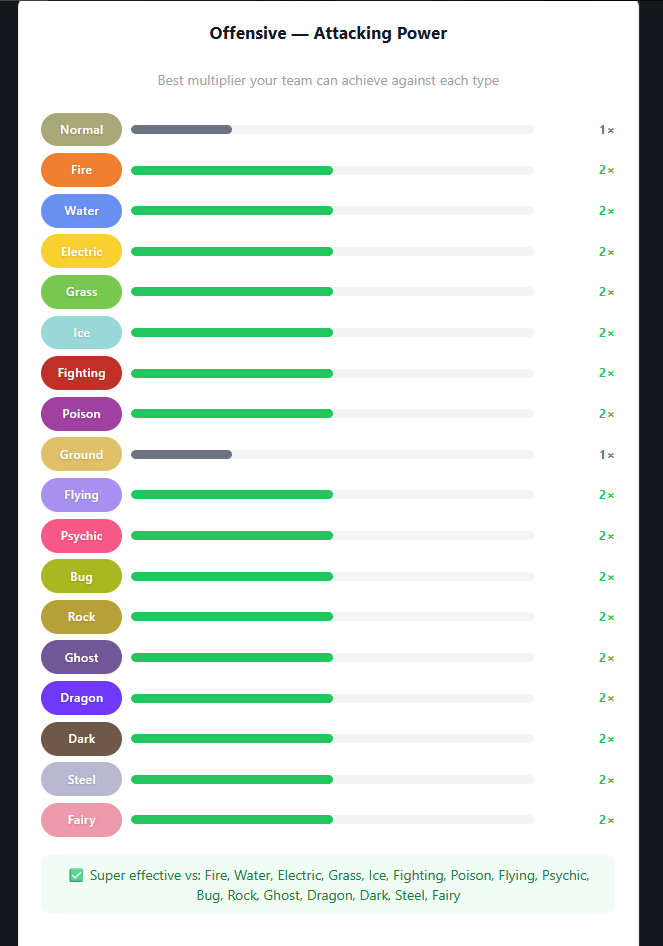
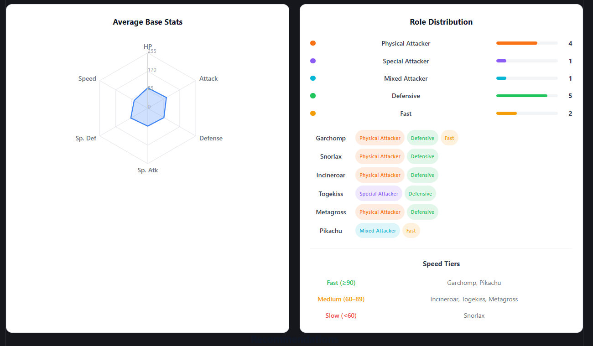
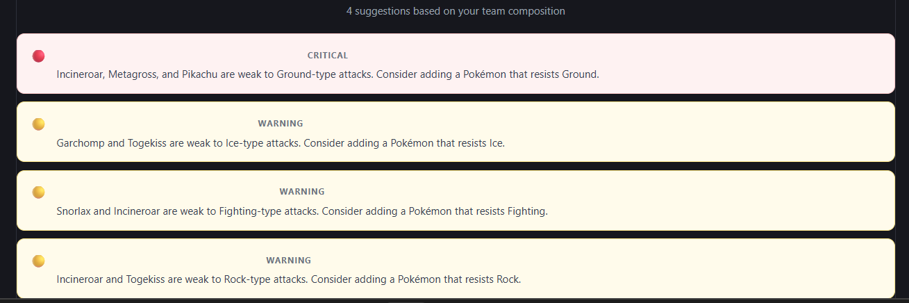

# Pokémon Team Builder

An interactive Pokémon team analysis tool built with React (Vite). Assemble a team of up to 6 Pokémon and get insights on type coverage, stat balance, role distribution, and team recommendations.

---

## Overview

### Architecture

The app is a single-page React application with no backend. All data is fetched directly from the [PokéAPI](https://pokeapi.co/) and analyzed client-side.
```
src/
  components/       # UI components (SearchBar, PokemonCard, TeamSlots, charts, etc.)
  context/          # TeamContext — global team state shared across components
  hooks/            # usePokemonList, usePokemonDetails — data fetching with caching
  utils/            # Pure analysis logic (type chart, type analysis, stat analysis, recommendations)
  App.jsx
```

### Key Design Decisions

- **Hardcoded type chart** — The 18×18 type effectiveness table is stored locally in `typeChart.js` rather than fetched from the API. This avoids 18 sequential API calls and makes the analysis instantaneous.
- **Module-level caching** — Both the full Pokémon name list and individual Pokémon details are cached in module-level variables. 
- **Pure utility functions** — All the logic (`typeAnalysis.js`, `statAnalysis.js`, `roleClassifier.js`, `recommendationEngine.js`) is framework-agnostic and side-effect free, making it easy to test independently.
- **TeamContext** — Avoids prop drilling by providing the team array and `addPokemon`/`removePokemon` actions to all components globally.

### Features

- Search and add up to 6 Pokémon using the PokéAPI
- Display sprite, types, base stats (with visual bars), and abilities per Pokémon
- **Defensive coverage** — shows how hard each type hits your team aggregated across all members
- **Offensive coverage** — shows the best multiplier your team can achieve against each type
- **Stat radar chart** — average base stats across the team visualized as a radar chart
- **Role classification** — classifies each Pokémon as Physical Attacker, Special Attacker, Mixed, Defensive, or Fast based on stat heuristics
- **Recommendations** — rule-based suggestions with severity levels (critical, warning, info) referencing specific Pokémon names

---

## Screenshots

### Team Builder

*Search and add up to 6 Pokémon to your team*

### Pokémon Cards

*Each card shows sprite, types, base stats, and abilities*

### Type Coverage
  

*Defensive and offensive type coverage analysis across your team*

### Stat Radar & Role Distribution

*Average base stats chart with role classification and speed tiers*

### Recommendations

*Rule-based suggestions*


---

## Setup Instructions

### Prerequisites

- Node.js
- npm

### Install dependencies
```bash
npm install
```

### Run the development server
```bash
npm run dev
```

Then open [http://localhost:5173](http://localhost:5173) in your browser.

### Build for production
```bash
npm run build
```

---

## Assumptions & Challenges

### Assumptions

- **Stat ordering from PokéAPI is fixed** — The API always returns stats in the order: HP, Attack, Defense, Special Attack, Special Defense, Speed. The `normalizePokemon.js` function relies on positional indexing (`stats[0]` through `stats[5]`).
- **Type effectiveness uses base game rules** — No abilities or held items that modify type interactions are factored in.
- **Official artwork sprite is preferred** — The normalizer falls back to `front_default` if the official artwork is unavailable for a given Pokémon.
- **Role heuristics are simplified** — A Pokémon is classified as a Physical Attacker if its Attack exceeds Special Attack by more than 10 points, and vice versa. These thresholds are reasonable approximations but do not reflect full analysis.
- **Offensive coverage is based on Pokémon types, not movesets** — The app assumes a Pokémon can effectively use moves of its own types. Actual moveset coverage is not considered.
- **Duplicate Pokémon are not allowed** — A Pokémon cannot be added to the team twice, matching standard competitive rules.

### Challenges

- **PokéAPI name list includes non-standard forms** — The `/pokemon?limit=10000` endpoint returns entries like `pikachu-alola`, `rotom-wash`, and other regional or form variants. These are valid entries and work correctly with the detail endpoint, so they are included in search results without filtering.
